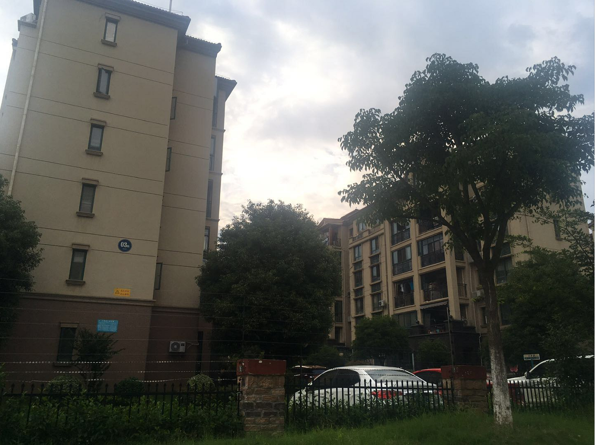

[TOC]

## 住宅小区要求

小区主要看：

**价格与配套设置**

**小区情况**（卫生，大小，物业，人车道）

**周围环境**（教育，风景，道路）

需要满足：卫生情况良好，周围比较安静不吵闹，人车分流，上班比较方便

我的工作地点在创业街烽火科技，女朋友的工作地点在光谷生物城（地铁11号线），或者花山（地铁19号线在建，预计2023年开通）

## 光谷附近

#### [保利花园](https://www.amap.com/place/B001B0K7DH)（进入）

- 价格与配套设置：房价大致2.2，04到08年修建，基础设施有老化，进入看到部分地方正在施工
- 小区情况：进入小区人工智能识别，靠近保利茉莉公馆，房子呈现四周辐射状况，小区绿化可以，但是不够规整，小区楼栋分布较乱，低楼层可能看不见阳光。人流处卫生尚可，边缘地带卫生不行，停车场位置不够，很多车都放在路边，小区里有流浪猫。安保情况尚可，但检查不够严格，基本上人车分离，至于公共器材比较少，周围小鸟较多，比较靠近街道，处于闹市，尽管已经在小区当中，依然可以感受到周围的声音，没有很多车鸣笛，但是有那种声音，可以接受，但是没有更好
- 周围环境：交通还算便利，但是地铁有一定距离，附近有医院，商圈，步行街，距离我上班的公司非常近，但是距离生物城或者未来与基因，每天通勤时间非常多将会达到一个小时之多，周围地铁也不够近

#### [保利茉莉公馆](https://www.amap.com/place/B001B1C2PN)（没进去）

- 价格与配套设置：价格大致2.5，15年建好，小区楼层大概16层
- 小区情况：相对来说比保利花园更加安静。卫生情况很好，物业管理严格，安保物业比保利花园更好，人车分流。缺点是小区相比保利花园比较小，小区区域并不规整，可以想到绿化面积更小
- 周围环境：基本与保利花园一致

## [马鞍山森林公园](https://www.amap.com/place/B001B0IZXU)附近

#### [新世界恒大华府](https://www.amap.com/place/B001B1DIF4)（进入）

- 价格与配套设施：两万三一平米，2012至2014年建好
- 小区情况：分为ab两片区域，坐在小区中间的花园里，夏天里有凉风吹过，小区干净卫生整洁，楼层大概是二十层，绿化非常不错，树木没乱长，但是身处其中不够宽阔，只能看到眼前
- 周围情况：靠近武汉市第二初级中学，光谷第八小学，华科附属中学，周围有马鞍山森林公园，附近车流量较小，距离生物城公交通勤时间一个小时，驾车11分钟，距离花山驾车25分钟，周围买菜不方便

[照片请点这里](https://github.com/pinwei1900/show/blob/master/%E7%9C%8B%E6%88%BF/%E6%96%B0%E4%B8%96%E7%95%8C%E6%81%92%E5%A4%A7%E5%8D%8E%E5%BA%9C.md)

#### [恒大华府](https://www.amap.com/place/B0FFF293CI)（没进入）

均价2.5，后面就是马鞍山森林公园，都是面积非常大，与新世界恒大华府紧临

[照片请点这里](https://github.com/pinwei1900/show/blob/master/%E7%9C%8B%E6%88%BF/%E6%96%B0%E4%B8%96%E7%95%8C%E6%81%92%E5%A4%A7%E5%8D%8E%E5%BA%9C.md)

#### [葛洲坝世纪花园一期](https://www.amap.com/place/B0FFGCBBW7)（1期进入）

- 价格与配套设施：均价1.9w，2009年建成
- 小区情况：紧邻恒大华府，街面干净，视野上十分开阔，小区内部十分安静，走路可以听见脚步声，小区风向很好，和恒大华府的规整性不同，生活区更加丰富和幽静，中心花园面积够大，夏季有微风可乘凉，小区人车分离，绿化面积足够，小区东部有普通道路，车流量不大
- 周围情况：与恒大华府一样，靠近武汉市第二初级中学，光谷第八小学，有马鞍山森林公园可以直接看到，交通方面不靠近地铁，驾车8公里到生物城，到未来组需要11公里（19分钟），公交9站到生物城，周围买菜不方便

[照片请点这里](https://github.com/pinwei1900/show/blob/master/%E7%9C%8B%E6%88%BF/%E8%91%9B%E6%B4%B2%E5%9D%9D%E4%B8%96%E7%BA%AA%E8%8A%B1%E5%9B%AD.md)

#### [葛洲坝世纪花园二期](https://www.amap.com/place/B0FFF0EU29)（2期进入）

- 价格与配套设置：与1期相差不多，1.9w左右，基本都09年建成
- 小区情况：环境卫生很好，小区楼层之间间隔很大，小区内部安静，视野相比1期更开阔，除了东边靠近三环线有不可避免的噪音
- 周围情况：与恒大华府一样，靠近武汉市第二初级中学，光谷第八小学，有马鞍山森林公园可以直接看到，交通方面不靠近地铁，没有地铁线，买菜不方便

[照片请点这里](https://github.com/pinwei1900/show/blob/master/%E7%9C%8B%E6%88%BF/%E8%91%9B%E6%B4%B2%E5%9D%9D%E4%B8%96%E7%BA%AA%E8%8A%B1%E5%9B%AD.md)

#### [葛洲坝世纪花园三期](https://www.amap.com/place/B0FFGCBBWD)（3期没看）

## 花山严西湖附近

[联投花山郡](https://www.amap.com/place/B001B1DEN8)（进入）
[万科花山紫悦湾](https://www.amap.com/place/B0FFG2M1C7)（没进入）
[碧桂园生态城](https://www.amap.com/place/B001B1H2TY)（没去看）

万科与联投花山郡面对面，中间有商圈，但是明显配套设置还没有跟起来，周围有花山郡小学，光谷第26小学，没有初中高中

优点：价格便宜，烽火有班车早上在花山，有武汉正在发展的软件新城，有软件公司和生物公司，女朋友工作地点有可能在附近工作，正在建立19号线，预计2023年完工。（我公司和女朋友工作地点均靠近地铁），环境优美，靠近严西湖

缺点：周围基础设施不够，教育不够

[照片请点这里](https://github.com/pinwei1900/show/blob/master/%E7%9C%8B%E6%88%BF/%E8%8A%B1%E5%B1%B1%E5%9C%B0%E5%8C%BA.md)

## 碧桂园生态城

生态城中有许多小区，基本分布在软件新城的周边环境中，高楼层二手均价1.3到1.4，低楼层二手价1.6，目前生活区有很多小孩子，周围的碧桂园小学。小区周边有小摊贩，有卖水果以及蔬菜，附近有商铺，可以吃饭，但是这些商贩的主要服务对象还是周围的软件新城。

#### 依云小区

这个小区主要是19层左右的楼房，小区之间有小花园，小区右边靠近花山大道，左边靠近别墅群，有地下停车场，小区靠近软件新城的一侧是小区重新花园地带，总体卫生还不错，入住的可能有大致一半人左右。除了小区有地摊，明显不正规，但是如果没有地摊，周围并没有什么大型的超市

#### 观澜小区

小区绿化面积比较少，楼栋之间比较近，紧靠软件新城，周围人员比较复杂，不太好

#### 山湖间小区

都是以低楼层为主，没有电梯，一楼有小庭院，小区分为左右两块入下图，右边属于高栋，左边属于低栋，低栋没有电梯

总结：

总体感受下来，碧桂园生态城对比之前看的葛洲坝小区，生活配套设施，以及小区环境，交通情况和坐落位置，都比不上，可能由于软件新城的存在，这个小区存在一些溢价的部分

至于在严西湖旁边的万科-花山紫悦湾，环境和位置相比碧桂园好很多，但是均价位1.6w

## 关于花山以及葛洲坝世纪花园之间的对比

首先看一下这张图

| 比较点 |                         花山（二手）                         |                            光谷东                            |
| :----: | :----------------------------------------------------------: | :----------------------------------------------------------: |
|  价格  |                         14000~16000                          |                            ~20000                            |
|  生态  |     更加乡村一些，靠近严西湖风景优美，附近有一个生态公园     |                        附近有森林公园                        |
|  人文  | 附近基础设置还有待建设，周围商圈比较少还不够成熟，目前入住人员还比较少，社区还不够成熟，仍需等待社区建设，大多数以年轻夫妻为主 | 基础设施比较完善，小区内老年人和中年夫妻为主，社区发展比较成熟稳定 |
|  交通  | 目前花山地区主要靠公交，2019年武汉市正在建设19号线，如果要生活在这里，每天上下班需要开车 | 比较靠近中心城区，距离地铁2.1公里，靠近生物城和我的工作地点  |
|  教育  |                附近有花山郡小学，光谷第26小学                |                  教育资源丰富，靠近华中科大                  |
|  生活  |            比较单调，周围没有太多商圈，还有待建设            |        附近商业区较少，但是非常靠近中心城区，出行方便        |

总结：选择花山必须考虑的是每天上下班需要开车，但是换的这个金钱是比较多的可能差别80万。选择光谷东就不用每天开车，可以通过公交等上下班，但公交慢

从通勤时间上来看，可能差别并不大，只是教育资源方面，真的和光谷东没有办法相比较

