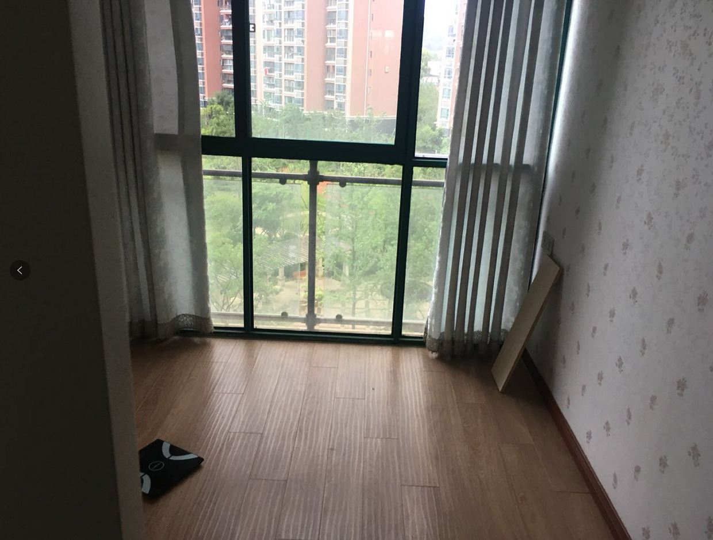

[TOC]

> 总结一下，之后看房拍照片需要拍摄的有：客厅，饭厅，厨房，阳台，卫生间，主卧，次卧，三卧
>
> 今天由于提前没有和中介交涉的很清楚，所以看的房子都不太满意。
>
> 再次写一下需求：
>
> 三房，装修好，卫生间倾向于2个但不排斥1个，面积大致120左右，不靠近吵闹的地方，总价尽量在250w上下，房子至少满2年倾向于满5年
>
> 明天再联系看一看

[查看网页版点这里](https://github.com/pinwei1900/show/blob/master/%E7%9C%8B%E6%88%BF/%E6%88%BF%E5%AD%90.md)

## 中环地产

#### 葛洲坝世纪花园一期

##### 第一套 第3层，总11层，房子面积144，满两年，总价273，单价1.89w，满两年

进门右拐第一栋，房子装修情况中等，面积比较大，中规中矩，

这是书房

书房与客厅中间是镂空的书架

饭厅与厨房

卧室没有飘窗

卫生间

另一个卫生间

卫生间内部

主卧室

卧室顶部

次卧

#### 葛洲坝世纪花园二期

##### 第二套   6楼    共4房   265w  20w的税  134平  没满两年

小区中心地带，还算比较安静，今天外面下雨，风很大，如果天气不好的话，关上窗户可能风也有点大，下面是主卧

阳台用来晾衣服

走道有点窄，不知道为什么这样设计，但是这样的话，使用面积会大一些

卫生间

主卧卫生间

有一个小书房

窗外的情况

##### 第三套  7楼    122平  265w   满两年 ，装修还行，但靠近铁路，很吵

刚进去的客厅，看起来很黑，但是其实窗帘拉起来后不黑，房间也还算是比较干净

饭厅

厨房也还好

窗外

卫生间

次卧

主卧内卫生间，但是好像没有拍主卧的照片

小书房，用来放置电脑还不错

